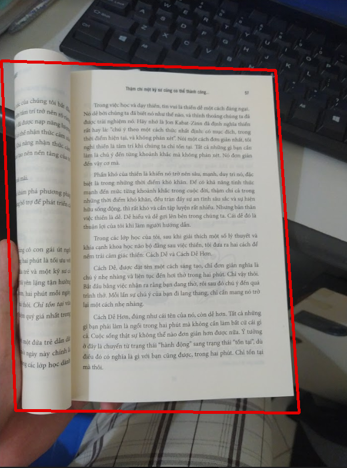

# Abstraction
This product is result of our team in software engineer project at university. The target of this project is finding 4 edges of a book.

# Requirements
* Windows (10/8/7) system
* OpenCV 3+
* VS code (optional)

# Install
## Build OpenCV binary file

**Step 1:** Download the OpenCV source from their repository. You can choose to download any one of them. You can download in [this](github.com/opencv/opencv/releases).

**Step 2:** Setup Mingw-64. Look [here](https://sourceforge.net/projects/mingw-w64/files/). Install this and make sure to include MinGW bin folder in your path.

**Step 3:** One done install Cmake. Open Cmake and do the following:

1. Open Cmake GUI.
2. Choose a source path (previous installed) and a binaries path.
3. One done click **configure**. A dialogue box will appear select MinGW Makefiles. This will make sure that the OpenCV new makefiles are compatible to mingw.
4. Click **Finish**. Go on and click on **Generate**.
5. After that C++ compilation process take a lot of time: *ONE HOUR*.
## Setup in VSCode
### Install CMake Tools in VSCode extension store.
### Create makefile with the contents:
```makefile
cmake_minimum_required(VERSION 3.xx)
project(project_name)

set(CMAKE_CXX_STANDARD 11)
set(CMAKE_CXX_STANDARD_REQUIRED True)

# Set variable
set(OpenCV_DIR path_to_lib_folder)
set(SOURCE_FILE *.h *.cpp)

# Excute command
add_executable(folder_working ${SOURCE_FILE})

# OpenCV libs
find_package(OpenCV REQUIRED)
include_directories(${OpenCV_INCLUDE_DIRS})
target_link_libraries(folder_working ${OpenCV_LIBS})
```
## Implementation
```git-bash
$ mkdir build
$ cmake -B ./build -G "MinGW Makefiles"
$ cd build
$ make   
$ ./file.exe
```

## Example

**Input image**:

 

**And the result:**


